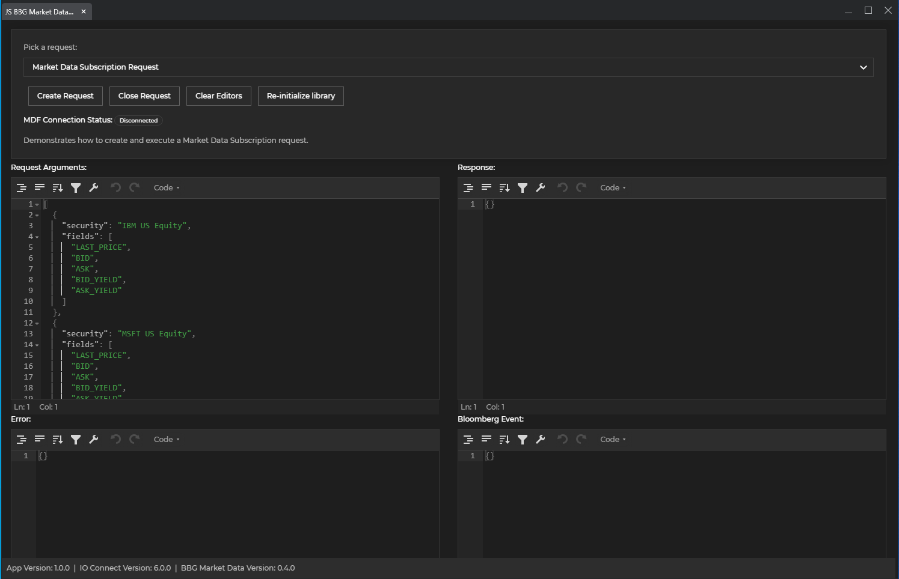

# bbg-market-data examples

The repository contains a simple application that demonstrates the usage of [@glue42/bbg-market-data](https://www.npmjs.com/package/@glue42/bbg-market-data).
The application allows selection of any request available from @glue42/bbg-market-data, opening the selected request and visualizing - data, errors, bloomberg event and request status.

## Prerequisites

- [io.Connect Desktop](https://interop.io/) / Glue42 Enterprise
- [Bloomberg Adapter](https://docs.interop.io/adapters/bloomberg/market-data/overview/index.html) - at least version 1.42
- [NodeJS and npm](https://nodejs.org/en/)

## Setup

- Clone the repository.
- Copy the app definition file `bbg-market-data-examples.json` to the io.Connect Desktop (%LocalAppData%/interop.io/io.Connect Desktop\config\apps) or io.Connect Browser applications store.
- Open terminal and run `npm install` to install all dependencies.
- Run `npm start`. The app will be hosted at http://localhost:3000.

Now you should be able to start the application from the App Manager. Search for _BBG Market Data Examples_.
